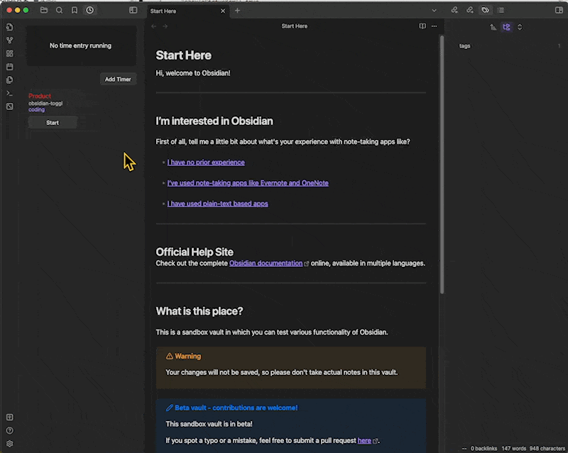

# Obsidian Toggl

# Overview

Inspired by the popular third-party app Timery for Toggl Track, I would like to create a Toggl integration plugin in Obsidian. 

Besides providing convenient start and stop timer functionality, I also hope to leverage the Obsidian ecosystem to enhance its functionality.

For example, creating Toggl tasks based on Obsidian notes, generate Toggl time entries report and insert them into Obsidian notes

## Features

- Inspect current time entry and you can stop it in obsidian
- Create timer with project, tags, description, and save it in local
- View timers and start timer

## Roadmap

- Edit/Delete timer
- Edit current tiem entry detail data
- generate report from time entries
- Generate Toggl task from Obsidian note

# Visuals

# Usage

1. Create you favorite timer
2. Start timer when you are working on related things
3. Stop timer when your are done
